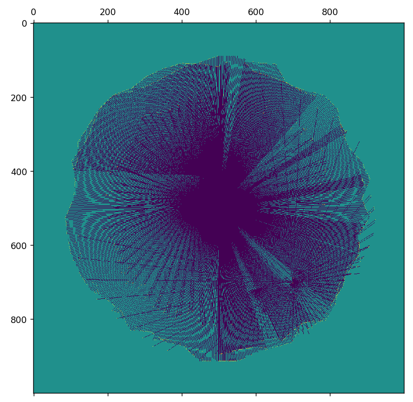

# TOF_GRID_MAPPING

The goal of this project was to implement occupancy grid mapping on a differential drive robot using odometry for localization and an IR ToF sensor for new data.

This is Lola, our robotic test platform. She uses a PIC32 microcontroller, DC motors, rotary encoders, and a ToF sensor.

Here is what Lola is capable of (this is using a binary grid map, whose implementation is found in FinalProject/GridMapping)

